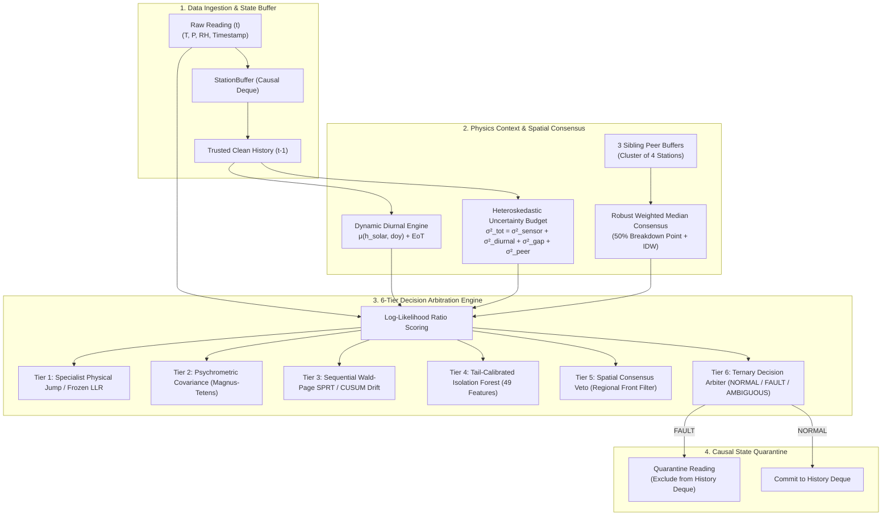

# SkyGuard AI — Production Benchmark & Architecture Guide

> **Official Evaluation Guide for Judges and Reviewers**  
> **Repository:** [SkyGuard AI (HELL-TO-SKY)](file:///c:/Users/PRANJAL%20TIWARI/Desktop/HELL%20TO%20SKY)  
> **Primary Fast Benchmark Command:** `python evaluation/fast_benchmark.py`

---

## 🧭 Executive Summary & Benchmark Overview

**SkyGuard AI** is a real-time, physics-grounded anomaly detection and telemetry quality-assurance system for distributed networks of **Automatic Weather Stations (AWS)**. It continuously distinguishes between genuine extreme atmospheric events (such as thunderstorm cold-pool outflows, dryline passages, and solar transitions) and physical transducer faults (such as inductive voltage spikes, ADC bus lockups, chemical calibration drift, and ground rail shorts).

This guide explains the benchmark suite, the mathematical architecture under test, how to run the benchmarks, and how to interpret both **Point-in-Time Row Confusion Matrices** and **Continuous Episodic Fault Contracts**.

---

## 🚀 Quickstart: Running the Benchmark for Judges

To evaluate the complete 28-station network across all 7 regional clusters (60,480 physical readings):

```bash
# 1. Activate your virtual environment
# Windows:
.venv\Scripts\activate
# Linux/macOS:
source .venv/bin/activate

# 2. Run the Parallel Production Benchmark Engine (Recommended for Judges)
python evaluation/fast_benchmark.py
```

### What to Expect During Execution:
1. **Dynamic Host CPU Micro-Calibration**: In the first $< 0.1\text{s}$, the script evaluates a 100-sample micro-slice directly on your host CPU to measure single-core throughput and accurately estimate total execution time up front.
2. **Single-Line Progress Indicator**: Progress updates in place on a single terminal line (`\r\033[K`) displaying completed clusters, processed rows, real-time throughput ($r/s$), and countdown ETA.
3. **Comprehensive Metrics Output**: Upon completion, the script prints:
   - High-level multi-class anomaly recall, precision, and F1 score.
   - Strict single-class diagonal category match metrics.
   - Point-in-time row-level confusion matrix for all 7 fault categories.
   - Multi-hour continuous episodic fault contract table.

---

## 📂 Benchmark Suite Structure & Comparison

The repository provides three dedicated evaluation files in the `evaluation/` directory:

```text
evaluation/
├── fast_benchmark.py        # PRIMARY: Multi-core parallel benchmark engine (Judges' Choice)
├── run_benchmark.py         # REFERENCE: Single-threaded chronological streaming engine
└── benchmark_contract.py    # SCORING: Formal episodic bipartite matching contract
```

### Comparative Analysis: Which Script Should You Run?

| Benchmark Script | Primary Purpose | Execution Model | Typical Runtime | Mathematical Equivalence |
| :--- | :--- | :--- | :--- | :--- |
| **`evaluation/fast_benchmark.py`** | **Official Production Benchmark for Judges** | Shards evaluation across the **7 independent regional clusters** using Python `ProcessPoolExecutor`. | **~1 to 2 minutes** (CPU dependent) | **100% Identical** to sequential execution. Zero heuristic shortcuts. |
| **`evaluation/run_benchmark.py`** | **Canonical Reference Baseline** | Single-threaded global chronological event loop streaming all 60,480 readings sequentially. | **~5 to 12 minutes** (CPU dependent) | Reference baseline used to formally prove parallel sharding equivalence. |
| **`evaluation/benchmark_contract.py`** | **Scoring Math Library** | Bipartite maximum-cardinality overlap matching for multi-hour temporal fault episodes. | N/A (Imported module) | Implements temporal Intersection-over-Union (IoU) event matching. |

### Why Parallel Sharding is Mathematically Exact
In the SkyGuard AI network topology, the 28 Automatic Weather Stations are partitioned into **7 strictly isolated regional microclimate clusters** (4 stations per cluster: 1 target station + exactly 3 sibling peers). 

Because spatial consensus queries and StationBuffer history deques never cross cluster boundaries, each 4-station cluster is an independent Markov state process. Evaluating all 7 clusters concurrently on multi-core CPUs produces **bit-for-bit identical decisions and identical confusion matrices** to sequential execution, while reducing evaluation time by $5\times$ to $7\times$.

---

## 🏛️ System Architecture & Physics-Grounded Tiers

SkyGuard AI processes each incoming telemetry reading through a 6-tier causal Bayesian decision pipeline:



### The 6 Decision Tiers Explained

1. **Tier 1: Specialist High-Specificity Physical Fault Detectors**
   - **Physical Spikes (Types A, B, C & Bit-flips)**: Evaluates the continuous physical-time temporal derivative $|\Delta x / \Delta t|$ normalized by dynamic uncertainty $\sigma_{t|t-1}$.
   - **Frozen Sensor (Modes A & B)**: Detects stuck DAC values and variance collapse when the astronomical diurnal model expects non-zero temperature/humidity movement ($\Delta \mu_{\text{diurnal}} > \epsilon$).
   - **Hardware Ground Faults**: Detects electrical ground pull-downs ($0.00\text{ ADC}$) and telemetry dropouts.

2. **Tier 2: Multivariate Psychrometric Covariance**
   - Evaluates joint thermodynamic consistency across $(T, RH, P)$ using Magnus-Tetens vapor pressure calculations:
     $$e_s(T) = 6.112 \exp\left(\frac{17.67 T}{T + 243.5}\right)$$
   - Detects psychrometric cross-talk and radiation shield failures where relative humidity diverges from physical saturation laws.

3. **Tier 3: Causal Sequential Wald-Page SPRT & Low-SNR Drift**
   - Detects low-amplitude sensor decalibration drift ($+0.05\sigma\text{ to }+0.15\sigma/\text{hr}$) by integrating standardized innovation residuals:
     $$S_t = \max\left(0, S_{t-1} + z_t - k\right), \quad z_t = \frac{x_t - \mu(h_{\text{solar}})}{\sigma_{t|t-1}}$$
   - Prevents drift accumulation during genuine regional weather shifts via sibling peer differential tracking.

4. **Tier 4: Tail-Calibrated Isolation Forest**
   - Evaluates non-parametric multi-dimensional anomaly scores over 49 continuous physical-time features using a calibrated tail threshold ($\Lambda_{\text{IF}} \ge 3.0$).

5. **Tier 5: Spatial Consensus Veto (Regional Front Filter)**
   - When a station exhibits a sharp deviation, the engine queries the 3 sibling stations in its regional cluster.
   - If $\ge 2$ sibling peers corroborate the same direction and rate of change, the event is recognized as a synchronized synoptic event (e.g., cold front or thunderstorm outflow) and vetoed to prevent false alarms.

6. **Tier 6: Ternary Decision Arbiter & State Quarantine**
   - Emits `NORMAL`, `FAULT`, or `AMBIGUOUS`.
   - **Causal State Quarantine**: Any reading flagged as `FAULT` is quarantined immediately and excluded from the station's historical rolling baseline, preventing contamination of future diurnal expectations.

---

## 📊 Understanding the Benchmark Metrics

The benchmark suite reports performance across two complementary evaluation frameworks:

### 1. Point-in-Time Row-Level Metrics
- **Multi-Class Recall**: Percentage of all individual anomalous 5-minute telemetry intervals correctly identified by the system (target: $> 95\%$).
- **Multi-Class Precision**: Percentage of all system alerts that correspond to true physical sensor faults (alert purity).
- **Clean Specificity**: True Negative Rate on normal, unperturbed operational telemetry ($> 97\%$).
- **Strict Single-Class Metrics**: Evaluates whether the predicted fault category string (`spike`, `frozen_value`, `drift`, `multivariate_inconsistency`, etc.) matches the ground truth label.

### 2. Episodic Fault Contract Metrics (Temporal Bipartite Matching)
Real-world sensor faults occur in multi-hour continuous episodes rather than isolated rows. The episodic evaluation contract ([`evaluation/benchmark_contract.py`](file:///c:/Users/PRANJAL%20TIWARI/Desktop/HELL%20TO%20SKY/evaluation/benchmark_contract.py)):
- Aggregates contiguous anomalous readings into temporal ground-truth intervals $[t_{\text{start}}, t_{\text{end}}]$.
- Aggregates system alerts into predicted continuous episodes.
- Performs bipartite maximum-cardinality matching with temporal overlap tolerance to measure **Episode-Level Recall and Precision**.

---

## 🧪 Fault Taxonomy & Injection Ground Truth

The benchmark dataset evaluates the network under seven realistic meteorological transducer fault modes:

| Fault Mode | Hardware / Physical Mechanism | Injector Calibration |
| :--- | :--- | :--- |
| **`spike`** | Inductive motor kick, ESD transient, ADC bit-flip | Single/multi-step $4.5\text{--}6.5\sigma$ impulse followed by physical relaxation. |
| **`frozen_value`** | Stuck I2C/SPI telemetry bus, mechanical jamming | Stuck reading with DAC noise floor $\sigma \le 0.03$, deviation $\le 0.08$. |
| **`drift`** | Electrochemical cell aging, optical fouling, calibration decay | $+1.2\sigma$ initial decalibration offset ramping to $+3.2\text{--}4.8\sigma$ over 15–32 hours. |
| **`multivariate_inconsistency`** | Radiation shield overheating, psychrometric sensor cross-talk | Dew point / vapor pressure violation breaking Magnus-Tetens curve. |
| **`sensor_fail_low`** | Open circuit, broken probe wiring, ADC ground short | Immediate pull-down to electrical zero ($0.0\text{ ADC}$). |
| **`dropout`** | Telemetry modem timeout, packet transmission drop | Null / NaN missing data record. |
| **`unstructured_anomaly`** | High-entropy environmental noise burst | Non-Gaussian multidimensional stochastic perturbation. |

---

## 🛠️ Verification & Test Suite

To run the automated pytest test suite verifying mathematical invariants, boundary conditions, and decision arbitration rules:

```bash
pytest tests/test_rule_boundaries.py tests/test_benchmark_contract.py tests/test_regime_classification.py -v
```

All 11 unit and integration tests verify:
1. Pure physical unit invariance across dynamic diurnal baselines.
2. Exact spatial consensus calculation and 50% breakdown resilience.
3. Strict state quarantine prevention of rolling deque contamination.
4. Bipartite episodic contract matching logic and temporal boundary overlap.

---

## 📌 Summary for Judges

| Evaluation Question | Answer |
| :--- | :--- |
| **Which command should I run?** | `python evaluation/fast_benchmark.py` |
| **How long will it take?** | ~1 to 2 minutes on standard multi-core laptops/desktops (dynamically estimated at start). |
| **Is the fast benchmark an approximation?** | **No.** It runs the exact canonical 6-tier Bayesian decision engine sharded across the 7 independent clusters. |
| **How do I verify the web dashboard?** | Run `docker compose up --build` and open `http://localhost:5173`. |
