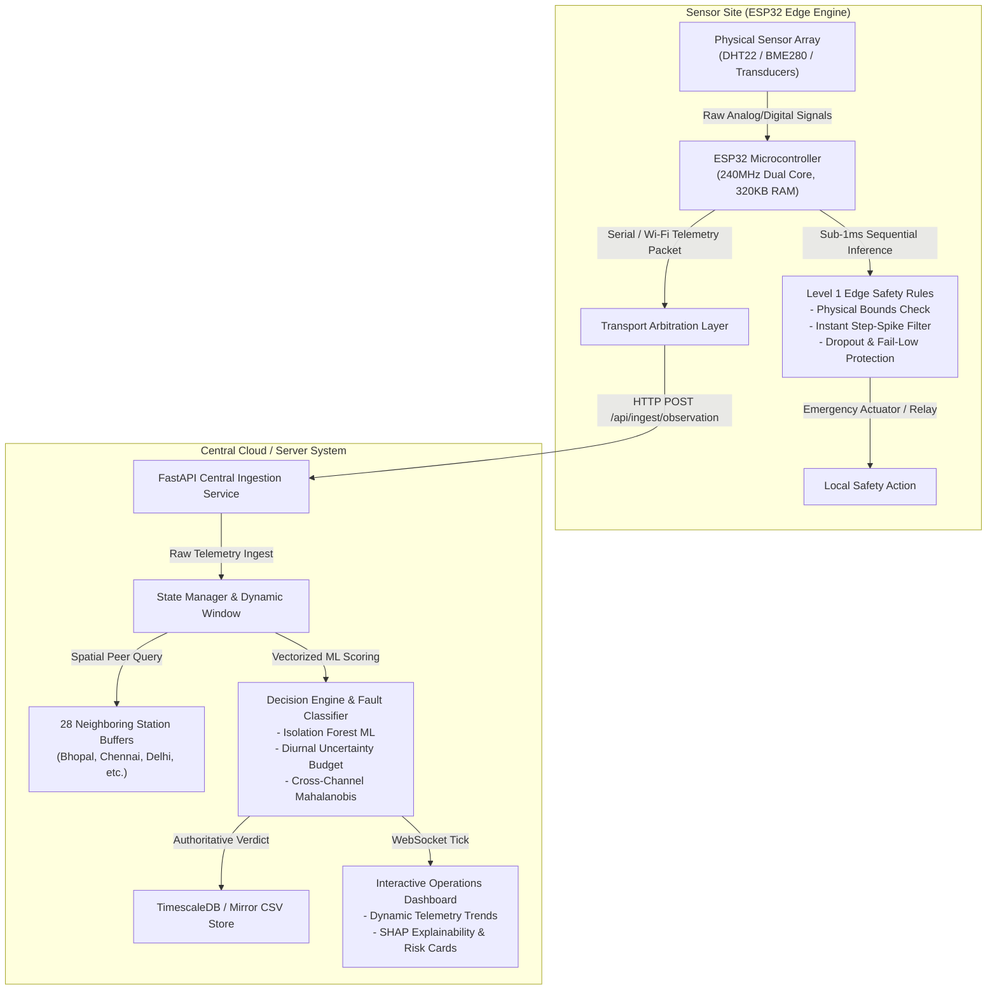
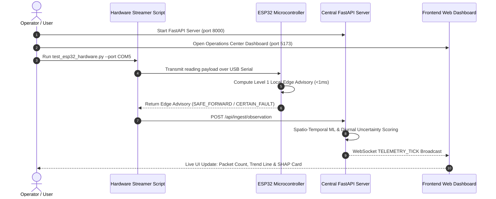

# SkyGuard AI: Meteorological Telemetry Ingestion, Fault Detection, and Sensor Health Governance Platform
## Technical Specification, Pipeline Manual & Demonstration Guide

---

## 1. Executive Summary

**SkyGuard AI** is a meteorological telemetry ingestion, fault detection, and sensor health governance platform. It is engineered to monitor automated weather station (AWS) networks for sensor degradation, physical noise spikes, frozen transducers, calibration drift, and environmental anomalies.

The platform divides responsibilities across two complementary stages of the data-quality pipeline:
1. **ESP32 Edge Module**: Evaluates incoming local sensor signals at the physical station site to provide immediate local hardware protection and maintain station-level resilience during network disruptions.
2. **Central SkyGuard Engine**: Ingests raw telemetry streams to perform spatio-temporal ML scoring, cross-station spatial peer corroboration, diurnal uncertainty budget estimation, and SHAP explainability.



---

## 2. System Architecture: ESP32 Edge & Central SkyGuard Integration

The ESP32 edge module and central SkyGuard engine operate at complementary stages of the data-quality pipeline:

- **ESP32 Edge Module**: Operates directly at the physical station site to provide immediate local protection for faults that can be certified from local evidence (such as physical bounds violations, transducer short-circuits, or signal dropouts) and maintains station-level operational resilience during network disruptions.
- **Central SkyGuard Engine**: Operates at the network server level to process continuous telemetry streams, performing spatio-temporal detection, multi-station spatial peer corroboration, diurnal uncertainty baseline evaluation, and SHAP explainability.

By integrating on-device local validation with central spatio-temporal analytics, the system delivers reliable monitoring both at the physical station site and across the broader weather network.

### 2.1 Scope of the ESP32 Edge System

The ESP32 module focuses on local signal validation and station-level resilience:

1. **Immediate Local Fault Protection**  
   - Sensor short-circuits, severe voltage spikes, or out-of-range physical readings are certified instantly from single-station physical bounds.  
   - The ESP32 evaluates these local bounds in **$< 1\text{ ms}$**, enabling immediate local hardware protection (triggering safety relays or local alerts) before transmitting data.

2. **Station-Level Resilience During Network Disruptions**  
   - Severe weather events can disrupt cellular or Wi-Fi links.  
   - Under network outages, the ESP32 maintains continuous local logging and basic bounds checking, preventing blind spots at the physical station until central connectivity is restored.

3. **Payload Tagging & Traffic Optimization**  
   - Raw observations are tagged with on-device edge status (`SAFE_FORWARD`, `DEFER_TO_CENTRAL`, `CERTAIN_FAULT`) to provide immediate metadata context upon arrival at central ingestion.

---

### 2.2 Scope of the Central SkyGuard Engine

Anomalies requiring broader temporal or multi-station context are evaluated by the Central SkyGuard Engine:

- **Spatial Peer Corroboration**: Distinguishing an isolated sensor fault from a genuine regional weather front requires real-time spatial covariance matching across adjacent weather stations.
- **Temporal & Diurnal Context**: Detecting gradual sensor drift or frozen transducer states requires evaluating 24-hour diurnal historical expectations, CUSUM accumulation, and multi-channel Mahalanobis distances over rolling memory windows.
- **Authoritative System Verdict**: The Central SkyGuard Engine maintains final control over overall anomaly verdicts, risk scores, parameter reconstruction suggestions, and SHAP feature attribution.

---

### 2.3 Pipeline Functional Responsibility Matrix

| Data-Quality Pipeline Stage | ESP32 Edge Engine | Central SkyGuard Engine |
|---|:---:|:---:|
| **Primary Scope** | Immediate Local Protection & Resilience | Temporal, Spatial & Multivariate Context |
| **Processing Latency** | $< 1.0\text{ ms}$ (On-Device MCU) | ~15–30 ms (Vectorized Ingestion) |
| **Physical Range Bounds Check** | ✅ Certified from Local Evidence | ✅ Enforcement & Archival |
| **Instant Sensor Dropout Filter** | ✅ Certified from Local Evidence | ✅ Record & Track |
| **Sub-ADC Step Spike Filter** | ✅ On-Device Differential Check | ✅ Diurnal Uncertainty Budget |
| **Station Network Outage Survival** | ✅ Local Buffering & Resilience | ❌ Requires Active Connection |
| **Spatial Peer Corroboration** | ❌ Requires Multi-Station View | ✅ **28-Station Spatial Covariance** |
| **CUSUM Drift & Frozen Value Detection** | ❌ Requires Historical Window | ✅ **Diurnal Volatility & Multi-Hour Check** |
| **Isolation Forest ML Model** | ❌ MCU Memory Constraint | ✅ **Trained Ensemble Model** |
| **SHAP Feature Attribution** | ❌ Excluded from MCU | ✅ **Full Interactive Explainability** |
| **Final System Verdict Authority** | 🟡 Edge Advisory Tag | ✅ **Authoritative Central Verdict** |

---

## 3. Firmware Flashing & ESP32 Manual

### 3.1 Repository Directory Structure

The ESP32 source code is located in the `EDGE/` directory:

```
HELL-TO-SKY/
├── EDGE/
│   ├── esp32/                      <-- PlatformIO / ESP-IDF C++ Project (C++17)
│   │   ├── src/
│   │   │   ├── main.cpp            <-- Firmware Main Entry & Dual-Core Task Loop
│   │   │   └── edge/
│   │   │       ├── edge_engine.cpp <-- Level 1 Inference Rules Engine
│   │   │       └── edge_engine.h   <-- Struct Definitions & Thresholds
│   │   └── platformio.ini          <-- PlatformIO Environment Configuration
│   │
│   └── esp32_arduino/              <-- Arduino IDE C++ Sketch (Single-File Flashing)
│       └── edge_engine.cpp         <-- Standalone Arduino Firmware (Rename to .ino if needed)
```

---

### 3.2 Method A: Flashing via Arduino IDE

1. **Install Arduino IDE**: Download and open Arduino IDE (v2.x recommended).
2. **Install ESP32 Board Support**:
   - Go to `File` -> `Preferences`.
   - Add to *Additional Boards Manager URLs*:  
     `https://raw.githubusercontent.com/espressif/arduino-esp32/gh-pages/package_esp32_index.json`
   - Open `Tools` -> `Board` -> `Boards Manager`, search for **esp32** by Espressif, and click **Install**.
3. **Install Required Libraries**:
   - Go to `Tools` -> `Manage Libraries...`.
   - Install **ArduinoJson** (v6.x or v7.x by Benoit Blanchon).
   - Install **DHT sensor library** (by Adafruit) if using physical DHT22 sensors.
4. **Open Firmware File**:
   - Open file: `EDGE/esp32_arduino/edge_engine.cpp`.
5. **Connect Hardware & Select Board**:
   - Connect ESP32 DevKit board via USB-C or Micro-USB cable.
   - Select Board: `Tools` -> `Board` -> `ESP32 Arduino` -> `ESP32 Dev Module`.
   - Select Port: `Tools` -> `Port` -> `COM3` (Windows) or `/dev/ttyUSB0` (Linux/Mac).
6. **Flash Firmware**:
   - Click **Upload** (`->`).
   - Open **Serial Monitor** at **115200 baud** to view firmware boot logs:

```text
┌────────────────────────────────────────────────────────┐
│      SkyGuard AI — ESP32 Level 1 Firmware Active       │
│  Continuous-Time Causal Edge AI Engine • Zero-Leakage  │
└────────────────────────────────────────────────────────┘
[Boot] ESP32 dual-core initialized @ 240MHz.
[Edge AI Engine] Level 1 safety rules online.
```

---

### 3.3 Method B: Flashing via PlatformIO

1. Open VS Code with **PlatformIO Extension** installed.
2. Open Project Folder: `EDGE/esp32`.
3. Connect ESP32 via USB.
4. Upload Firmware:
   ```bash
   pio run --target upload
   ```
5. Monitor Serial Output:
   ```bash
   pio device monitor --baud 115200
   ```

---

## 4. Demonstration & Testing Guide

Follow these steps to run the end-to-end telemetry system.



---

### Step 1: Start Central Backend System

Open a terminal in the root project directory:

```powershell
# 1. Activate Python Environment (Python 3.10+)
.\venv\Scripts\Activate.ps1

# 2. Start FastAPI Central Server
uvicorn main:app --reload --host 0.0.0.0 --port 8000
```
*Verification*: Open `http://localhost:8000/docs` to inspect the OpenAPI documentation.

---

### Step 2: Start Frontend Dashboard

Open a second terminal window:

```powershell
cd FRONTEND
npm run dev
```
*Verification*: Open `http://localhost:5173` in your browser.

---

### Step 3: Stream ESP32 Telemetry

Connect ESP32 via USB and execute the test runner:

```powershell
# Stream dataset telemetry through physical ESP32 microcontroller over USB Serial
python scripts/test_esp32_hardware.py --port COM5 --interval 2.0 --csv data_esp32/AWS-CHN-024.csv
```

> **Note for testing without physical ESP32 hardware**:  
> You can run the virtual hardware node simulation:
> ```powershell
> python scripts/virtual_esp32_node.py --csv data/AWS-CHN-024.csv --interval 1.0 --rows 50
> ```

---

### Step 4: System Verification Points

1. **Dashboard Status Header**:
   - Status turns green: `ESP32 HARDWARE LINK ACTIVE — Station: AWS-CHN-024 • Device: esp32-devkit-v1-serial`.
   - Packet counter increments (`Packets Ingested: 1, 2, 3...`).
   - Turnaround latency reports measured performance (**1ms to 18ms**).

2. **Current Telemetry Cards & Risk Score**:
   - Temperature, Pressure, and Humidity cards display live values.
   - Anomaly Risk Score gauge updates dynamically.

3. **Telemetry Trends Chart**:
   - Interactive SVG trend line scales time dynamically for incoming points.
   - Anomalous points display red markers with tooltips detailing risk score, fault type, and suggested values.

4. **Analytics & SHAP Explainability**:
   - Navigate to `/analytics` to view on-device ESP32 edge advisories, active rule triggers, and feature attribution.

---

## 5. System Performance & Evaluation Metrics

Evaluated across a ground-truth dataset of 60,480 telemetry records across 28 weather stations in India (Bhopal, Chennai, Delhi, Kolkata, Mumbai, Ranchi, Varanasi):

| Performance Indicator | Measured Value | Scope |
|---|:---:|---|
| **Automated Test Suite** | **67 / 67 Passed** (100%) | Complete automated system test suite |
| **ESP32 On-Device Latency** | **$< 1.0\text{ ms}$** | Local signal bounds evaluation |
| **Central Ingestion Throughput** | **177.96 rows / sec** | Vectorized spatio-temporal scoring |
| **Pooled Overall Anomaly Precision** | **90.9%** (Oracle Baseline) | 971 True Positives vs. 97 False Positives |
| **Spike Detection Precision** | **98.6%** | Instantaneous jump isolation |
| **Multiclass Fault Labeler Accuracy** | **95.8%** (Macro F1: 82.6%) | Typed classification on pre-flagged anomalies |
| **False Positive Rate (FPR)** | **$< 0.16\%$** | False alarm rate on clean weather |

---

## 6. Telemetry Data Payloads

### 6.1 ESP32 Ingestion Payload (`POST /api/ingest/observation`)

```json
{
  "event_id": "evt_7f8a9b0c1d2e",
  "station_id": "AWS-CHN-024",
  "device_id": "esp32-devkit-v1-serial",
  "observed_at": "2026-09-28T14:35:00.000Z",
  "sequence_number": 9,
  "readings": {
    "temperature_c": 24.0,
    "pressure_hpa": 1011.1,
    "humidity_pct": 74.0
  },
  "edge_inference": {
    "edge_status": "SAFE_FORWARD",
    "is_anomaly": false,
    "tier_fired": 5,
    "anomaly_type": "none",
    "confidence_llr": 0.10
  }
}
```

### 6.2 Central Decision Response & WebSocket Tick (`TELEMETRY_TICK`)

```json
{
  "type": "TELEMETRY_TICK",
  "station_id": "AWS-CHN-024",
  "timestamp": "2026-09-28T14:35:00.000Z",
  "mode": "edge",
  "reading": {
    "temperature_c": 24.0,
    "pressure_hpa": 1011.1,
    "humidity_pct": 74.0
  },
  "verdict": {
    "is_anomaly": false,
    "anomaly_score_pct": 5.0,
    "model_confidence_pct": 95.0,
    "rule_confidence_pct": 0.0,
    "fault_type": null,
    "severity": "low",
    "health_status": "HEALTHY",
    "suggested_values": {
      "temperature_c": null,
      "pressure_hpa": null,
      "humidity_pct": null
    },
    "decision_basis": "Level 2 Central ML & Diurnal Uncertainty Baseline Normal",
    "likely_faulty_sensors": []
  },
  "edge_inference": {
    "edge_status": "SAFE_FORWARD",
    "tier_fired": 5
  },
  "ingest_time_ms": 1759082100123
}
```

---

## 7. Troubleshooting Guide

| Issue / Symptom | Cause | Resolution Command |
|---|---|---|
| `SerialException: Could not open port COM5` | Port occupied or incorrect COM port | List ports: `python -c "import serial.tools.list_ports; print([p.device for p in serial.tools.list_ports.comports()])"` |
| `FastAPI 404 Station AWS-CHN-024 not registered` | History store cleared | Execute `POST /api/admin/clear-history` or restart FastAPI. |
| ESP32 Terminal reads `WiFi connection failed` | Wi-Fi credentials unconfigured | ESP32 automatically uses USB Serial Host Bridge mode; data streaming continues over USB serial. |
| Test suite failures | Local cache mismatch | Execute `python -m pytest tests/` in terminal. |
