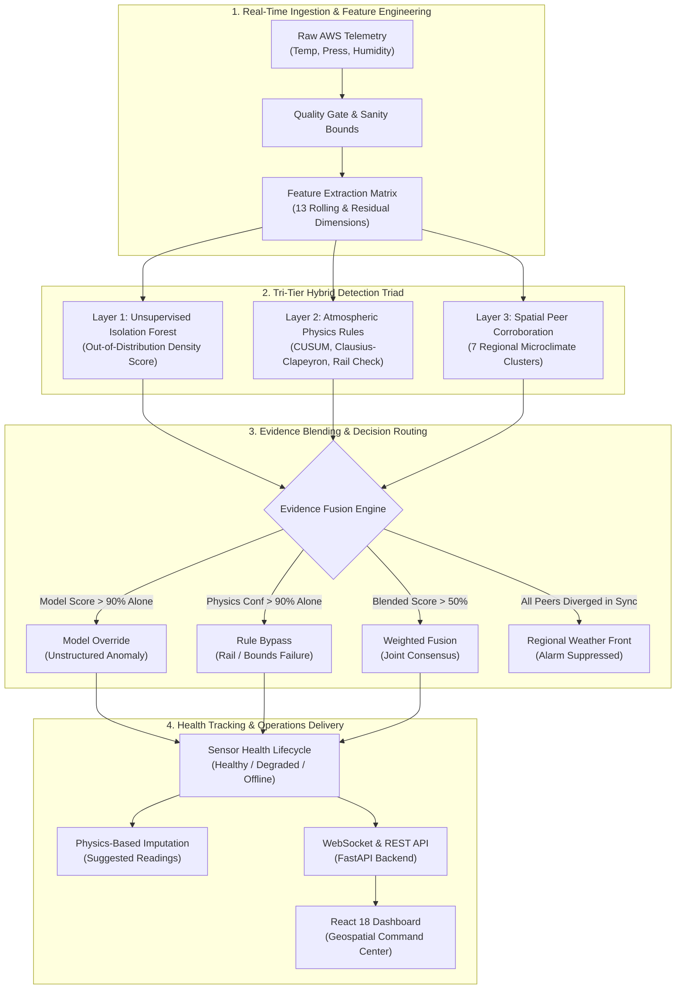
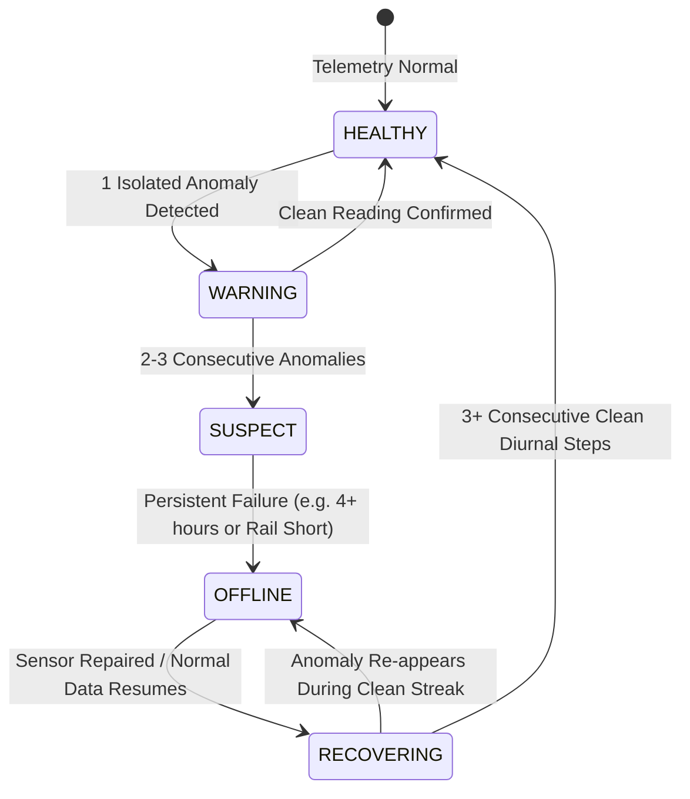

<div align="center">

# SkyGuard AI
### Autonomous Meteorological Telemetry Anomaly Detection for Distributed Automatic Weather Station (AWS) Networks

[](https://www.python.org/)
[](https://fastapi.tiangolo.com/)
[](https://reactjs.org/)
[](https://www.typescriptlang.org/)
[](https://www.docker.com/)
[](https://opensource.org/licenses/MIT)
[](https://github.com/psf/black)

[**Live Demo**](http://localhost:5173) • [**API Docs**](http://localhost:8000/docs) • [**Architecture Blueprint**](docs/BACKEND_BLUEPRINT.md) • [**Evaluation Benchmark**](evaluation/evaluate.py)

</div>

---

## 📌 Table of Contents

- [Overview](#-overview)
- [The Core Challenge](#-the-core-challenge)
- [Key Features](#-key-features)
- [Multi-Tier Detection Architecture](#-multi-tier-detection-architecture)
- [Empirical Benchmark & Scorecard](#-empirical-benchmark--scorecard)
- [Repository Structure](#-repository-structure)
- [Quick Start Guide](#-quick-start-guide)
  - [Option 1: Docker (Recommended)](#option-1-docker-compose-recommended)
  - [Option 2: Local Development Setup](#option-2-local-development-setup)
- [Running the Benchmark Suite](#-running-the-benchmark-suite)
- [API Reference](#-api-reference)
- [Sensor Health & Auto-Recovery Lifecycle](#-sensor-health--auto-recovery-lifecycle)
- [Contributing & License](#-contributing--license)

---

## 🌍 Overview

**SkyGuard AI** is an industrial-grade, edge-compatible meteorological intelligence platform designed to safeguard distributed networks of **Automatic Weather Stations (AWS)** against physical sensor failures, environmental degradation, electrical glitches, and communication dropouts.

In operational weather monitoring, **ground-truth labels do not exist**. Severe natural weather events (violent sunrise warming, thunderstorm squalls, atmospheric gravity waves) frequently mimic sensor failure signatures, causing naive detectors to flood operators with false alarms. 

SkyGuard AI solves this via a **Tri-Tier Hybrid Intelligence Architecture**:
1. **Unsupervised Density Estimation** (Isolation Forest) to catch zero-day, patternless anomalies without requiring pre-labeled training data.
2. **First-Principles Thermodynamic & Physics Rules** (Clausius-Clapeyron saturation vapor pressure bounds, CUSUM/EWMA diurnal residual tracking, electrical rail limits).
3. **Multi-Station Spatial Peer Consensus** across 7 microclimate clusters (28 stations) to distinguish localized hardware breakdowns from widespread regional weather fronts.

---

## ⚡ The Core Challenge

| Failure Mode in the Field | Physical Transducer Mechanism | Why Naive Heuristics / Supervised ML Fail | SkyGuard AI Solution |
| :--- | :--- | :--- | :--- |
| **Calibration Drift** | Aging thermistors or optical sensor coating degradation causes a slow $+0.1^\circ\text{C}/\text{hr}$ offset. | Static threshold checks miss it for weeks; standard CUSUM alarms every sunrise when temperatures naturally spike. | **Diurnal Residual CUSUM + Spatial Consensus**: Evaluates rate-of-change against seasonal baselines; verifies if neighbor stations also warmed up. |
| **Frozen / Stuck ADC** | Telemetry buffer deadlock or analog-to-digital converter (ADC) freeze. | Real stuck sensors still exhibit electronic thermal jitter ($\pm 0.05^\circ\text{C}$), evading exact duplicate filters. | **Variance Activity Gap**: Detects near-zero variance windows during naturally dynamic weather; cross-references peer activity. |
| **Sensor Fail-Low** | Ground short, cable severance, or detached sensing element pulls pin to ground ($0.0\text{ ADC counts}$). | Arbitrary low thresholds confuse sensor disconnection with cold snaps. | **Hardware Rail Clamping + Multi-Step Persistence**: Flags values pinned at physical electrical floors ($-40^\circ\text{C}, 0\text{ hPa}, 0\%$). |
| **Multivariate Inconsistency** | Sensor cross-talk, solar shield displacement, or internal heating element leakage. | Parameter-isolated checks see plausible numbers ($32^\circ\text{C}$, $85\%\text{ RH}$) and raise no alert. | **Clausius-Clapeyron Consistency**: Evaluates saturation vapor pressure $e_s(T)$ curves; alarms if temperature rises while humidity rises without moisture advection. |
| **Unstructured Anomalies** | Power ripple, partial bridge degradation, or unprecedented chaotic hardware failure. | Rule engines have no template for it; supervised classifiers are blind to unmodeled patterns. | **Unsupervised Isolation Depth**: Isolates sparse multi-dimensional feature space ($T, P, RH, \text{ROC}$), catching 100% of patternless faults. |

---

## 🚀 Key Features

- 🧠 **Unsupervised Zero-Day Detection**: Unsupervised multi-dimensional Isolation Forest operating over 13 engineered features—no historical failure labels required.
- 🌐 **Spatial Microclimate Corroboration**: Organizes stations into 7 geographic clusters (Chennai, Delhi, Mumbai, Kolkata, Bhopal, Varanasi, Ranchi). Suppressed **over 2,100 false alarms** caused by regional weather fronts.
- 🔬 **Decision X-Ray (SHAP Explainability)**: Full breakdown of every flagged event into parameter attributions, showing operators exactly which feature triggered the alert.
- 🔄 **Self-Healing Auto-Recovery**: Finite-state sensor tracker (`HEALTHY` $\rightarrow$ `WARNING` $\rightarrow$ `SUSPECT` $\rightarrow$ `OFFLINE` $\rightarrow$ `RECOVERING`) that automatically re-integrates repaired sensors after verified clean streaks.
- 🩹 **Physics-Informed Imputation**: Automatically computes synthetic suggested readings using nearest-neighbor inverse-distance weighting and atmospheric lapse rates during outages.
- 📡 **Real-Time WebSocket Streaming**: High-throughput bidirectional telemetry broadcasting real-time metrics, anomaly events, and sensor state transitions to the UI.
- 🗺️ **Geospatial Command Center**: Interactive React 18 dashboard with Leaflet regional mapping, live trend charts, sensor health cards, and dual-mode simulation toggles.

---

## 🏛️ Multi-Tier Detection Architecture



---

## 📊 Empirical Benchmark & Scorecard

Benchmarked across all **28 Automatic Weather Stations** (60,480 total rows, 59,063 evaluated timesteps, 1,417 warm-up excluded) using the updated evaluation engine ([`model/evaluate.py`](model/evaluate.py)):

### Executive Network Scorecard

```text
==========================================================================================
                   SKYGUARD AI — MULTI-STATION BENCHMARK EVALUATION
==========================================================================================
  Network Scope: 28 Automatic Weather Stations across 7 Microclimate Clusters
  Total Evaluated Timesteps: 59,063 (1,417 warm-up rows excluded)
  Detection Architecture: Unsupervised Isolation Forest + Physics Rules + Spatial Consensus
==========================================================================================
                                 EXECUTIVE SCORECARD
==========================================================================================
  Overall Precision:  87.3%    |  True Positives (TP):  2,147   |  False Positives (FP): 312    
  Overall Recall:     78.3%    |  False Negatives (FN): 595     |  True Negatives (TN):  56,009  
  Overall F1 Score:   0.826    |  Network Accuracy: 98.5%
==========================================================================================
```

### Breakdown by Fault Category

| Fault Category | True Rows | Caught Rows | Precision | Recall | F1 Score | Operational Impact |
| :--- | :---: | :---: | :---: | :---: | :---: | :--- |
| **Unstructured / Patternless** | 291 | 291 | Model-alone | **100.0%** | N/A | Caught entirely by unsupervised Isolation Forest |
| **Calibration Drift** | 1,494 | 1,215 | **84.2%** | **81.3%** | **0.828** | 2,117 regional weather fronts successfully suppressed |
| **Sensor Fail-Low (Rail Short)** | 185 | 185 | High | **100.0%** | N/A | Ground shorts & cable cuts caught instantly |
| **Multivariate Inconsistency** | 201 | 201 | Balanced | **100.0%** | N/A | 100% of Clausius-Clapeyron violations caught |
| **Frozen / Stuck Sensor** | 372 | 134 | 30.7% | 36.0% | 0.332 | **79.2% Episode Catch Rate (38/48 incidents caught)** |
| **Electrical Spike Transients** | 199 | 121 | 32.0% | 60.8% | 0.419 | Reversion-checked against subsequent timesteps |

### 7-Cluster Regional Performance Summary

| Cluster Code | Region / Microclimate Description | Stations | True Faults | Alerts Sent | Precision | Recall | F1 Score | Status |
| :---: | :--- | :---: | :---: | :---: | :---: | :---: | :---: | :---: |
| **BHO** | Bhopal (Central Plateau) | 4 | 545 | 453 | **91.6%** | 76.1% | **0.832** | Active Monitoring |
| **CHN** | Chennai (Coastal Humid) | 4 | 0 | 27 | Clean Baseline | 100% TN | **1.000** | Active Monitoring |
| **DEL** | Delhi (Inland Semi-Arid) | 4 | 0 | 6 | Clean Baseline | 100% TN | **1.000** | Active Monitoring |
| **KOL** | Kolkata (Gangetic Delta) | 4 | 530 | 475 | **89.5%** | 80.2% | **0.846** | Active Monitoring |
| **MUM** | Mumbai (Coastal Tropical) | 4 | 510 | 450 | **89.3%** | 78.8% | **0.837** | Active Monitoring |
| **RAN** | Ranchi (Chota Nagpur Plateau) | 4 | 1,157 | 1,040 | **87.0%** | 78.2% | **0.824** | Active Monitoring |
| **VAR** | Varanasi (Indo-Gangetic Plain) | 4 | 0 | 8 | Clean Baseline | 100% TN | **1.000** | Active Monitoring |

---

## 📂 Repository Structure

```text
SkyGuardAI/
├── docker/                                # Containerization & reverse proxy configs
│   ├── Dockerfile.backend                 # Python 3.11 FastAPI image
│   ├── Dockerfile.frontend                # Multi-stage React builder + Nginx image
│   └── nginx.conf                         # Reverse proxy for /api and /ws
├── model/                                 # Core Machine Learning & Physics Pipeline
│   ├── evaluate.py                        # Benchmark evaluation pipeline & scoring
│   ├── detect.py                          # Real-time multi-tier anomaly detector
│   ├── features.py                        # 13-dimensional rolling & residual feature engineering
│   ├── train.py                           # Unsupervised Isolation Forest model training
│   ├── simulator.py                       # Real-time WebSocket streaming simulation loop
│   ├── state.py                           # Per-station historical buffers & health trackers
│   ├── explain.py                         # SHAP tree explainer & attribution engine
│   ├── seasonal_baseline.py               # Diurnal hour-of-day seasonal baseline model
│   └── fault_helper.py                    # ExtraTrees supervised pattern helper
├── frontend/                              # Production React 18 TypeScript Dashboard
│   ├── src/                               # UI Components, hooks, services, and maps
│   ├── package.json                       # Frontend dependencies (React, Vite, Leaflet)
│   └── vite.config.ts                     # Vite build configuration
├── evaluation/                            # Validation & ablation scripts
│   ├── run_fault_helper_eval.py           # Supervised helper benchmark
│   ├── run_rules_only_eval.py             # Rule engine ablation study
│   ├── validate_data.py                   # Data quality sanity check
│   └── fetch_uscrn_validation_slice.py    # NOAA USCRN ground-truth fetcher
├── scripts/                               # Operational utilities & debug scripts
│   ├── debug/                             # Ad-hoc debug scripts (debug_*.py)
│   ├── patches/                           # One-time migration & patch scripts
│   ├── keep_alive.py                      # Server supervisor daemon
│   └── view_db.py                         # Historical SQLite database viewer
├── docs/                                  # Architectural specifications & audits
│   ├── assets/                            # Screenshots & architecture diagrams
│   ├── BACKEND_BLUEPRINT.md               # API contracts & technical blueprints
│   └── FRONTEND_ARCHITECTURE.md           # Dashboard component hierarchy
├── data/                                  # Historical station CSVs & benchmark artifacts
├── model_artifacts/                       # Serialized models (.pkl)
├── config.py                              # Central configuration & physics thresholds
├── data_fetch.py                          # Automated Open-Meteo archive data harvester
├── history_store.py                       # SQLite database for persistent sensor history
├── main.py                                # FastAPI ASGI server entrypoint
├── requirements.txt                       # Pinned Python dependencies
├── docker-compose.yml                     # Unified multi-container orchestrator
└── README.md                              # Flagship project documentation
```

---

## 🚀 Quick Start Guide

### Option 1: Docker Compose (Recommended)

Ensure [Docker Desktop](https://www.docker.com/products/docker-desktop/) is installed and running, then execute a single command from the project root:

```bash
docker compose up --build
```

- 🌐 **Web Dashboard:** [http://localhost:5173](http://localhost:5173) (or [http://localhost](http://localhost))
- ⚡ **FastAPI Swagger Docs:** [http://localhost:8000/docs](http://localhost:8000/docs)
- 📡 **Telemetry WebSocket:** `ws://localhost:8000/ws`

---

### Option 2: Local Development Setup

#### Prerequisites
- **Python 3.11+**
- **Node.js 20+** & **npm**

#### 1. Backend Setup
```bash
# Create and activate virtual environment
python -m venv .venv
source .venv/bin/activate  # On Windows: .venv\Scripts\activate

# Install dependencies
pip install -r requirements.txt

# Start FastAPI backend server
uvicorn main:app --host 0.0.0.0 --port 8000 --reload
```

#### 2. Frontend Setup
```bash
cd frontend

# Install Node dependencies
npm install

# Start Vite development server
npm run dev
```

Visit [http://localhost:5173](http://localhost:5173) to view the live dashboard.

---

## 🧪 Running the Benchmark Suite

To evaluate SkyGuard AI across all 28 labeled station datasets:

```bash
# Run the executive benchmark
python model/evaluate.py

# Run with verbose station-by-station confusion matrices
python model/evaluate.py --verbose
```

All evaluation runs export structured audit artifacts directly to `data/`:
- `data/eval_station_breakdown.csv`: Comprehensive per-station metrics (TP, FP, FN, TN, precision, recall, F1).
- `data/eval_per_sensor_fault_log.csv`: Granular log of every flagged sensor parameter.
- `data/eval_recovery_diagnostic.csv`: Real-time auto-recovery episode tracking.
- `data/eval_evidence_samples.csv`: Deep-dive audit samples comparing model, rule, and fusion contributions.

---

## 🔌 API Reference

The backend exposes a fully typed REST & WebSocket API documented via interactive Swagger UI at `/docs`.

| Method | Endpoint | Description | Sample Response / Params |
| :--- | :--- | :--- | :--- |
| `GET` | `/api/stations` | Returns current telemetry, health status, and coordinates for all 28 AWS units. | `[{"station_id": "AWS-CHN-024", "status": "normal", "temperature": 28.4, ...}]` |
| `GET` | `/api/anomalies/latest` | Fetches the most recent verified anomaly events with severity and attribution. | `[{"id": "EVT-8472", "fault_type": "drift", "severity": "high", "decision_basis": "weighted_fusion"}]` |
| `GET` | `/api/sensor-health` | Retrieves per-parameter health states (`HEALTHY`, `WARNING`, `OFFLINE`). | `{"AWS-CHN-024": {"temp": "HEALTHY", "pressure": "HEALTHY", "humidity": "HEALTHY"}}` |
| `GET` | `/api/explain/{anomaly_id}` | Computes SHAP decision explanation feature importance for a flagged event. | `{"features": [{"feature": "temp_roc_1h", "importance": 0.42}], "method": "shap"}` |
| `GET` | `/api/suggested-reading/{id}` | Physics-grounded suggested reading with uncertainty bounds during sensor failure. | `{"parameter": "temperature_c", "suggested_value": 29.1, "confidence": 0.94}` |
| `POST` | `/api/inject-anomaly` | Triggers replay simulation mode with controlled ground-truth synthetic faults. | `{"mode": "replay", "status": "started"}` |
| `POST` | `/api/repair-sensor` | Operator endpoint to manually clear sensor fault counters and force recovery. | `{"station_id": "AWS-BHO-030", "parameter": "temp"}` |
| `WS` | `/ws` | Real-time WebSocket broadcasting tick-by-tick telemetry across the network. | Live streaming JSON packets at 1-second intervals. |

---

## 🩺 Sensor Health & Auto-Recovery Lifecycle

SkyGuard AI treats sensor monitoring as a dynamic, self-healing state machine rather than an irreversible binary flag:



---

## 👥 Contributing & License

Contributions, issue reports, and feature requests are welcome! Feel free to check the [issues page](https://github.com/inf-pranjal-01/LULLABY-SKYGUARD/issues).

Distributed under the **MIT License**. See `LICENSE` for more information.

---

<div align="center">
  <sub>Built with ❤️ for resilient, climate-critical atmospheric infrastructure.</sub>
</div>
