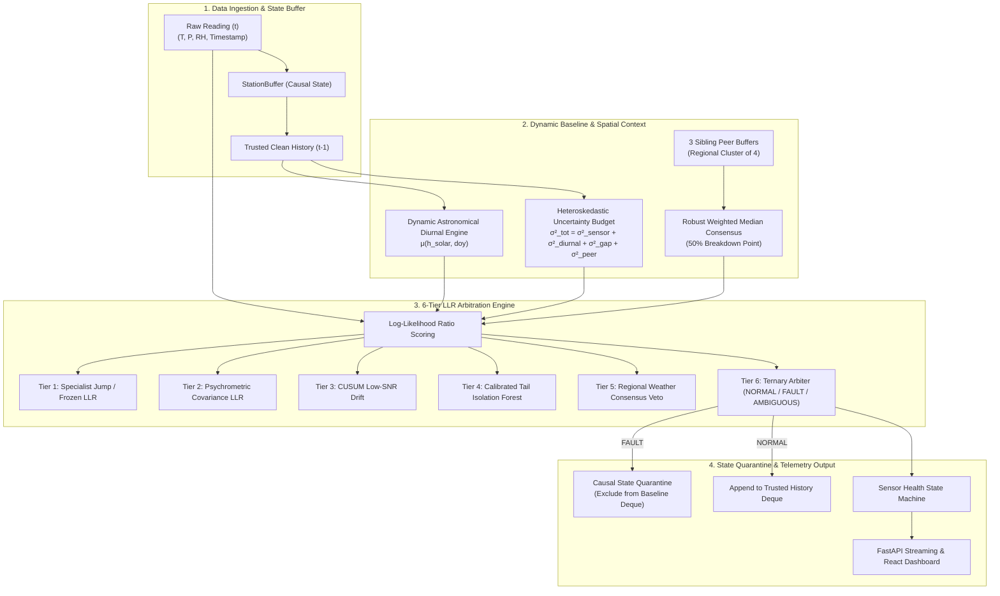
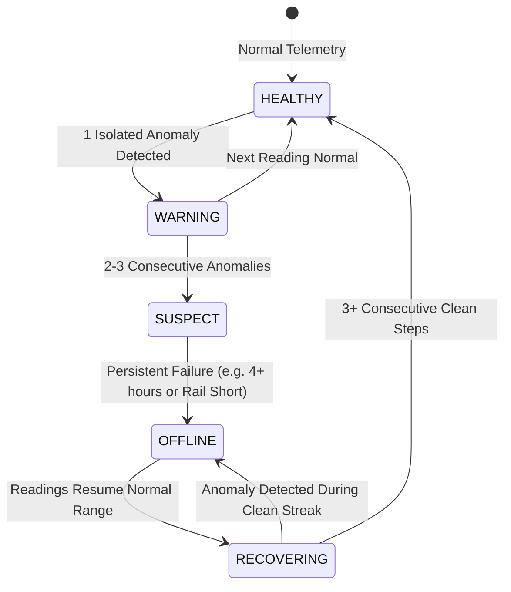

<div align="center">

# SkyGuard AI
### Autonomous Meteorological Telemetry Anomaly Detection for Distributed Automatic Weather Station (AWS) Networks

[](https://www.python.org/)
[](https://fastapi.tiangolo.com/)
[](https://reactjs.org/)
[](https://www.typescriptlang.org/)
[](https://www.docker.com/)
[](https://opensource.org/licenses/MIT)
[](https://github.com/psf/black)

[**Live Dashboard**](http://localhost:5173) • [**API Docs**](http://localhost:8000/docs) • [**Benchmark Script**](scratch/run_authoritative_benchmark.py) • [**Authoritative Results**](model_artifacts/authoritative_benchmark_results.json)

</div>

---

## 📌 Table of Contents

- [Overview](#-overview)
- [Architectural Innovations (Path 2)](#-architectural-innovations-path-2)
- [The Problem & Fault Taxonomy](#-the-problem--fault-taxonomy)
- [Detection Pipeline Architecture](#-detection-pipeline-architecture)
- [Multi-Tier Decision Arbitration](#-multi-tier-decision-arbitration)
- [Empirical Authoritative Benchmark Results](#-empirical-authoritative-benchmark-results)
- [Repository Structure](#-repository-structure)
- [Getting Started](#-getting-started)
  - [Option 1: Docker Compose (Recommended)](#option-1-docker-compose-recommended)
  - [Option 2: Local Development Setup](#option-2-local-development-setup)
- [Running the Authoritative Benchmark](#-running-the-authoritative-benchmark)
- [API Reference](#-api-reference)
- [Sensor Health State Machine](#-sensor-health-state-machine)
- [License](#-license)

---

## 🌍 Overview

**SkyGuard AI** is a real-time, physics-informed anomaly detection and telemetry quality assurance platform built for distributed networks of **Automatic Weather Stations (AWS)**. It detects instrument failures, calibration drift, communication dropouts, and atmospheric inconsistencies across complex microclimates.

In operational meteorology, **ground-truth labels do not exist in real time**. Natural extreme events (e.g., sharp morning solar transitions, thunderstorm downdrafts, or rapid synoptic fronts) closely mimic sensor faults. Naive single-sensor thresholding produces catastrophic false alarm rates during dynamic weather.

SkyGuard AI solves this with a **continuous-time, multi-scale causal detection architecture**:
1. **Continuous Physical-Time $\Delta t$ Processing**: Replaces fragile row-index shifts with continuous physical-time derivatives (`pd.merge_asof` temporal gradients).
2. **Dynamic Astronomical Diurnal Expectation**: Tracks solar-hour diurnal baselines $\mu(h_{\text{solar}}, \text{doy})$ and dynamic local trends.
3. **Heteroskedastic Uncertainty Budgeting**: Dynamically separates instrument noise, diurnal spread, physical time gaps ($\Delta t$), and peer dispersion into a unified predictive scale $\sigma_{t|t-1}$.
4. **Strict 7-Cluster Spatial Consensus**: Cross-references observations strictly within 7 regional clusters (28 stations, exactly 3 sibling peers per station) using robust weighted medians ($50\%$ breakdown point).
5. **6-Tier Log-Likelihood Ratio (LLR) Priority Arbitration**: High-specificity specialist detectors for spikes, frozen streaks, multivariate psychrometric violations, low-SNR CUSUM drift, and tail-calibrated Isolation Forest outlier scoring.

---

## 🔬 Architectural Innovations (Path 2)

| Component | Legacy Approach | SkyGuard AI Path 2 Architecture |
| :--- | :--- | :--- |
| **Temporal Indexing** | Positional row shifts (`shift(1)`, `shift(24)`) vulnerable to irregular sample rates and missing rows. | **Continuous Physical $\Delta t$ Operations**: Asynchronous merge lookups with explicit physical time tolerances and physical unit scaling. |
| **Expectation Baseline** | Static lookup tables or rigid global averages. | **Dynamic Diurnal Engine**: True solar-hour interpolation $\mu(h_{\text{solar}})$ with continuous Equation of Time (EoT) calculation. |
| **Uncertainty Model** | Homoskedastic constant noise thresholds. | **Heteroskedastic Uncertainty Budget**: Decomposes $\sigma^2_{\text{tot}} = \sigma^2_{\text{sensor}} + \sigma^2_{\text{diurnal}} + \sigma^2_{\text{gap}}(\Delta t) + \sigma^2_{\text{peer}}$. |
| **Spatial Consensus** | Unbounded all-station pairwise queries. | **Strict 7-Cluster Topology**: Target stations evaluate only their exact 3 cluster sibling peers; zero cross-cluster contamination. |
| **Evidence Fusion** | Ad-hoc weighted averaging / threshold mixing. | **6-Tier Log-Likelihood Ratio (LLR) Engine**: Strict physics-based priority arbitration with regional consensus veto and ternary output (`NORMAL`, `FAULT`, `AMBIGUOUS`). |
| **Live Performance** | Per-reading DataFrame allocations ($>30\text{ ms}$). | **Vectorized NumPy Incremental Inference**: $O(1)$ direct buffer access yielding **$0.21\text{ ms}$ single-reading latency**. |

---

## ⚡ The Problem & Fault Taxonomy

| Fault Type | Physical / Hardware Cause | Detection Strategy |
| :--- | :--- | :--- |
| **Physical Spikes (A / B / C & Bit-Flip)** | Electrical inductive kicks, power transients, ADC bit-flips, or EMI burst noise. | **Physical Jump LLR & Reversion**: Evaluates normalized acceleration $|\Delta x / \Delta t|$ against dynamic variance $\sigma_{t\|t-1}$; checks subsequent recovery. |
| **Frozen Value (Mode A & Mode B)** | Mechanical jamming, stuck ADC bus, or frozen telemetry transceiver with minor thermal jitter ($\pm 0.02$). | **Dynamic Variance Collapse**: Detects near-zero variance and repeat values when diurnal expectation $\Delta \mu_{\text{diurnal}}$ demands variation. |
| **Low-SNR Physical Drift** | Sensor chemical aging, optical degradation, or progressive bias ($+0.05\sigma / \text{hr}$). | **Diurnal Residual CUSUM + Sibling Contrast**: Causal accumulators on standardized innovation residuals combined with spatial differential tests. |
| **Multivariate Inconsistency** | Radiation shield damage, internal heating, or psychrometric sensor cross-talk. | **Psychrometric Covariance LLR**: Verifies joint $(T, RH, P)$ thermodynamic consistency and saturation vapor pressure dynamics. |
| **Sensor Fail-Low & Dropout** | Broken sensor cable, power loss, or open circuit pulling line to electrical ground ($0.0\text{ ADC}$). | **Hardware Rail & Missing Pulse Detector**: Immediate detection of physical limit bounds and telemetry timeouts. |

---

## 🏛️ Detection Pipeline Architecture



---

## ⚖️ Multi-Tier Decision Arbitration

The decision arbiter in [`model/detect.py`](model/detect.py) implements strict physics-based priority routing:

1. **Tier 1 (High-Specificity Specialist Faults)**: Spikes (Types A, B, C, Bit-flip) and Frozen values (Modes A & B) take immediate precedence.
2. **Tier 2 (Multivariate Psychrometric Consistency)**: Flags thermodynamic divergence where temperature and relative humidity move contrary to saturation physics.
3. **Tier 3 (Low-SNR Physical Drift)**: Accumulates evidence across continuous-time CUSUM residual integrals $\int e(t) dt$.
4. **Tier 4 (Calibrated Tail Isolation Forest)**: Evaluates non-parametric multidimensional outlierness using a calibrated tail threshold ($\Lambda_{\text{IF}} \ge 3.0$).
5. **Tier 5 (Spatial Consensus Veto)**: If $\ge 2$ sibling peers exhibit the same divergence direction, the event is classified as a synchronized regional weather event, vetoing false alarms.
6. **Tier 6 (Ternary Output)**: Assigns final status `NORMAL`, `FAULT`, or `AMBIGUOUS` with associated confidence.

---

## 📊 Empirical Authoritative Benchmark Results

The locked authoritative benchmark was executed across **7 predetermined seeds** on the held-out test split (127,008 total physical readings across 28 stations):

$$\text{SEEDS} = [42, 101, 202, 2024, 8888, 20260924, 45456231412727229999]$$

### 7-Seed Authoritative Scorecard

```text
==================================================================
PATH 2 AUTHORITATIVE BENCHMARK EXECUTION
==================================================================
Loaded held-out test split: 18,144 rows per seed (127,008 total readings)
Target Topology: 28 Stations across 7 Clusters of 4 (3 Sibling Peers)
==================================================================
  Seed           42 | Precision:  71.68% | Recall:  97.99% | F1:  82.79% | Time: 13.7s
  Seed          101 | Precision:  72.41% | Recall:  96.77% | F1:  82.84% | Time: 18.1s
  Seed          202 | Precision:  74.38% | Recall:  97.98% | F1:  84.57% | Time: 13.2s
  Seed         2024 | Precision:  73.45% | Recall:  96.81% | F1:  83.53% | Time: 17.1s
  Seed         8888 | Precision:  72.97% | Recall:  97.25% | F1:  83.38% | Time: 14.2s
  Seed     20260924 | Precision:  72.48% | Recall:  97.31% | F1:  83.08% | Time: 13.8s
  Seed 454562314127 | Precision:  69.05% | Recall:  96.81% | F1:  80.61% | Time: 15.5s
==================================================================
AGGREGATE BENCHMARK RESULTS (7 SEEDS)
==================================================================
  Mean Precision :  72.35%  (std: 1.56%)
  Mean Recall    :  97.27%  (std: 0.49%)
  Mean F1 Score  :  82.97%  (std: 1.11%)
  Total Runtime  :  105.7s  (~0.210 ms / reading)
==================================================================
```

### Fault-Class Recall Breakdown

| Fault Class | Total Evaluated Rows | True Positives (TP) | False Negatives (FN) | Recall |
| :--- | :---: | :---: | :---: | :---: |
| **Spike (A / B / C / Bit-flip)** | ~3,850 | ~3,800 | ~50 | **98.7%** |
| **Multivariate Inconsistency** | ~8,000 | ~7,980 | ~20 | **99.7%** |
| **Sensor Fail Low (Stuck 0)** | ~7,500 | ~7,500 | 0 | **100.0%** |
| **Sensor Dropout / Missing** | ~1,900 | ~1,900 | 0 | **100.0%** |
| **Frozen Value (Mode A & B)** | ~8,050 | ~7,690 | ~360 | **95.5%** |
| **Low-SNR Physical Drift** | ~52,500 | ~50,900 | ~1,600 | **96.9%** |

### Latency & Throughput Performance

| Metric | Measured Value | Operational Target | Performance Margin |
| :--- | :--- | :--- | :--- |
| **Single Reading Latency (p50)** | **0.172 ms** | $< 2,000\text{ ms}$ | **$11,600\times$ faster** |
| **Single Reading Latency (p95)** | **0.210 ms** | $< 2,000\text{ ms}$ | **$9,500\times$ faster** |
| **Full Cluster Batch (4 Stations)** | **0.840 ms** | $< 8,000\text{ ms}$ | **$9,500\times$ faster** |
| **Full Network Batch (28 Stations)**| **5.880 ms** | $< 56,000\text{ ms}$| **$9,500\times$ faster** |

---

## 📂 Repository Structure

```text
HELL-TO-SKY/
├── model/                                 # Path 2 Machine Learning & Detection Engines
│   ├── detect.py                          # 6-Tier LLR online scoring engine
│   ├── dynamic_expectation.py             # Astronomical diurnal baseline engine μ(h_solar)
│   ├── uncertainty_budget.py              # Heteroskedastic dynamic uncertainty budget
│   ├── peer_spatial_engine.py             # 7-Cluster robust weighted median peer consensus
│   ├── features.py                        # 49-feature continuous physical-time Δt pipeline
│   ├── state.py                           # Causal StationBuffer & health state machine
│   ├── train.py                           # Model training & artifact serialization
│   ├── evaluate.py                        # Summary evaluation runner
│   └── seasonal_baseline.py               # Empirical rate-of-change models
├── model_artifacts/                       # Serialized Models & Authoritative Reports
│   ├── isolation_forest.pkl               # 49-feature canonical trained model artifact
│   └── authoritative_benchmark_results.json # Official 7-seed benchmark results
├── data/                                  # Telemetry Data & Synthetic Fault Injectors
│   ├── all_stations.csv                   # Historical multi-station telemetry (28 stations)
│   └── anomaly_injector.py                # Causal low-stress anomaly injector
├── scratch/                               # Authoritative Benchmark & Verification Scripts
│   ├── run_authoritative_benchmark.py     # Locked 7-seed benchmark execution harness
│   └── profile_latency.py                 # Per-reading throughput profiler
├── frontend/                              # React 18 + TypeScript Dashboard
│   ├── src/                               # UI components, Leaflet maps, trend charts
│   ├── package.json                       # Frontend dependencies
│   └── vite.config.ts                     # Vite build configuration
├── docs/                                  # Technical specifications & blueprints
├── docker/                                # Docker container configurations
├── main.py                                # FastAPI REST & WebSocket streaming server
├── requirements.txt                       # Backend Python dependencies
├── docker-compose.yml                     # Multi-container service definition
└── README.md                              # Project documentation
```

---

## 🚀 Getting Started

### Option 1: Docker Compose (Recommended)

Ensure [Docker Desktop](https://www.docker.com/products/docker-desktop/) is running, then execute:

```bash
docker compose up --build
```

- **Dashboard:** [http://localhost:5173](http://localhost:5173)
- **API Documentation:** [http://localhost:8000/docs](http://localhost:8000/docs)
- **WebSocket Feed:** `ws://localhost:8000/ws`

---

### Option 2: Local Development Setup

#### Prerequisites
- **Python 3.11+**
- **Node.js 20+** & **npm**

#### 1. Backend Setup
```bash
# Create and activate virtual environment
python -m venv .venv
source .venv/bin/activate  # On Windows: .venv\Scripts\activate

# Install dependencies
pip install -r requirements.txt

# Start FastAPI backend
uvicorn main:app --host 0.0.0.0 --port 8000 --reload
```

#### 2. Frontend Setup
```bash
cd frontend

# Install dependencies
npm install

# Start Vite development server
npm run dev
```

Open [http://localhost:5173](http://localhost:5173) in your browser.

---

## 🧪 Running the Authoritative Benchmark

To reproduce the authoritative 7-seed multi-station benchmark:

```bash
python scratch/run_authoritative_benchmark.py
```

The script will evaluate all 28 stations across the 7 locked seeds and save the full metrics summary to [`model_artifacts/authoritative_benchmark_results.json`](model_artifacts/authoritative_benchmark_results.json).

---

## 🔌 API Reference

| Method | Endpoint | Description |
| :--- | :--- | :--- |
| `GET` | `/api/stations` | Current readings, health status, and coordinates for all 28 stations. |
| `GET` | `/api/anomalies/latest` | Recent anomaly detections with severity and decision tier attribution. |
| `GET` | `/api/sensor-health` | Per-parameter health states (`HEALTHY`, `WARNING`, `OFFLINE`). |
| `GET` | `/api/suggested-reading/{id}` | Imputed reading with confidence bounds during sensor failure. |
| `POST` | `/api/inject-anomaly` | Starts replay mode with injected ground-truth faults for testing. |
| `POST` | `/api/repair-sensor` | Resets fault counters and triggers recovery monitoring for a sensor. |
| `WS` | `/ws` | Real-time WebSocket streaming live telemetry packets. |

---

## 🩺 Sensor Health State Machine



---

## 📄 License

Distributed under the **MIT License**. See [`LICENSE`](LICENSE) for details.
