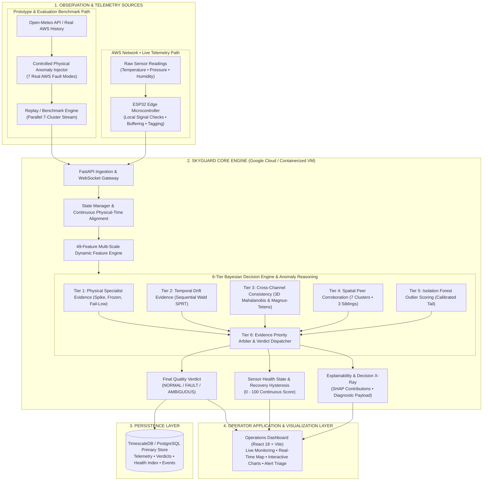
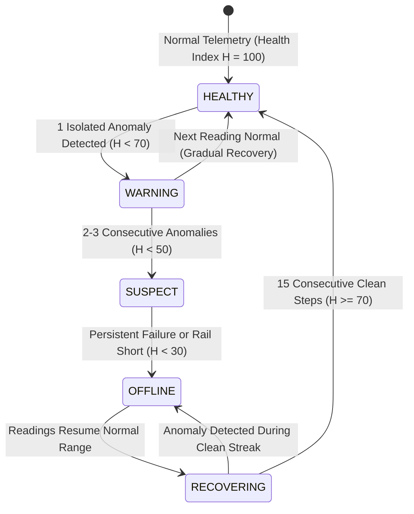

<div align="center">

# SkyGuard AI
### Autonomous Meteorological Telemetry Anomaly Detection & Quality Assurance for Distributed Automatic Weather Station (AWS) Networks

[](https://www.python.org/)
[](https://fastapi.tiangolo.com/)
[](https://reactjs.org/)
[](https://www.typescriptlang.org/)
[](https://www.docker.com/)
[](https://cloud.google.com/)
[](https://opensource.org/licenses/MIT)

**[🌐 Live Demo Dashboard (HTTPS Secure)](https://34-93-226-151.sslip.io)** • **[⚡ Backend API Docs](https://34-93-226-151.sslip.io/docs)** • **[📊 Fast Benchmark Engine](evaluation/fast_benchmark.py)**

---

### 📚 Official Project Documentation
[**1. External Research Impact (PDF)**](https://1drv.ms/b/c/60115d4b10b633da/IQC9U3kfnIf-QpTj7x5j_4wkAQXQQOvHEIpnT2Q4vGgZ4QA?e=SMnCpD) • [**2. Technical Methodology & Architecture (PDF)**](https://1drv.ms/b/c/60115d4b10b633da/IQD_FsEHaKwFT7Wfm4cQsGgLAftP2txmCJrQxgIpIJXdNUw?e=IAfyC1) • [**3. Experimental Performance Casebook (PDF)**](https://1drv.ms/b/c/60115d4b10b633da/IQDSQYAGIDHhS5f7SIgnwKhtAVboqVnNghDWWUAkIoZj6-I?e=wWg8Ny) • [**4. Edge AI ESP32 Architecture (PDF)**](https://1drv.ms/b/c/60115d4b10b633da/IQBTdSgyCfbwT6Vy0p0166tpAbaZ1pELUb_bp6A8-Cm8jTk?e=iWgqSL)

</div>

---

## 📌 Table of Contents

- [Overview](#-overview)
- [System Architecture & Documentation](#-system-architecture--documentation)
- [The Problem & Fault Taxonomy](#-the-problem--fault-taxonomy)
- [Detection Pipeline Architecture](#-detection-pipeline-architecture)
- [Multi-Tier Decision Arbitration](#-multi-tier-decision-arbitration)
- [Production Benchmark Evaluation & Results](#-production-benchmark-evaluation--results)
- [Repository Structure](#-repository-structure)
- [Deployment & Getting Started](#-deployment--getting-started)
  - [Google Cloud Platform (Live VM Deployment)](#-google-cloud-platform-live-vm-deployment)
  - [Local Docker Compose Setup](#-local-docker-compose-setup)
  - [Local Python & Node Setup](#-local-python--node-setup)
- [Running the Benchmark (Judges' Guide)](#-running-the-benchmark-judges-guide)
- [API Reference](#-api-reference)
- [Sensor Health State Machine](#-sensor-health-state-machine)
- [License](#-license)

---

## 🌍 Overview

**SkyGuard AI** is a real-time, physics-informed anomaly detection and telemetry quality assurance platform built for distributed networks of **Automatic Weather Stations (AWS)**. It detects instrument failures, calibration drift, communication dropouts, and atmospheric inconsistencies across complex microclimates.

In operational meteorology, **ground-truth labels do not exist in real time**. Natural extreme events (e.g., sharp morning solar transitions, thunderstorm cold-pool outflows, or rapid synoptic fronts) closely mimic sensor faults. Naive single-sensor thresholding produces catastrophic false alarm rates during dynamic weather.

SkyGuard AI solves this with a **continuous-time, multi-scale causal detection architecture**:
1. **Continuous Physical-Time $\Delta t$ Processing**: Replaces fragile row-index shifts with continuous physical-time derivatives (`pd.merge_asof` temporal gradients).
2. **Dynamic Astronomical Diurnal Expectation**: Tracks solar-hour diurnal baselines $\mu(h_{\text{solar}}, \text{doy})$ and dynamic local trends.
3. **Heteroskedastic Uncertainty Budgeting**: Dynamically separates instrument noise, diurnal spread, physical time gaps ($\Delta t$), and peer dispersion into a unified predictive scale $\sigma_{t|t-1}$.
4. **Strict 7-Cluster Spatial Consensus**: Cross-references observations strictly within 7 regional clusters (28 stations, exactly 3 sibling peers per station) using robust weighted medians ($50\%$ breakdown point).
5. **6-Tier Log-Likelihood Ratio (LLR) Priority Arbitration**: High-specificity specialist detectors for spikes, frozen streaks, multivariate psychrometric violations, low-SNR Wald SPRT drift, and tail-calibrated Isolation Forest outlier scoring.

---

## 📖 System Architecture & Documentation

For in-depth technical analysis, mathematical derivations, and hardware deployment blueprints, refer to our official documentation suite:

| Document | Primary Focus | Official PDF Link |
| :--- | :--- | :--- |
| **Doc 1: External Research Impact** | Comprehensive socio-economic impact analysis, agricultural resilience, disaster early warning, and meteorological quality benchmarks. | [**Open Document 1 (PDF)**](https://1drv.ms/b/c/60115d4b10b633da/IQC9U3kfnIf-QpTj7x5j_4wkAQXQQOvHEIpnT2Q4vGgZ4QA?e=SMnCpD) |
| **Doc 2: Technical Methodology & Architecture** | Formal mathematical derivations for dynamic diurnal baselines, Wald-Page SPRT drift, 3D Mahalanobis covariance, and thermodynamic invariants. | [**Open Document 2 (PDF)**](https://1drv.ms/b/c/60115d4b10b633da/IQD_FsEHaKwFT7Wfm4cQsGgLAftP2txmCJrQxgIpIJXdNUw?e=IAfyC1) |
| **Doc 3: Experimental Performance Casebook** | Empirical evaluation casebook, 60,480 telemetry benchmark breakdown, confusion matrices, and episodic temporal matching analysis. | [**Open Document 3 (PDF)**](https://1drv.ms/b/c/60115d4b10b633da/IQDSQYAGIDHhS5f7SIgnwKhtAVboqVnNghDWWUAkIoZj6-I?e=wWg8Ny) |
| **Doc 4: Edge AI ESP32 Architecture** | MicroPython / C++ embedded sensor edge firmware, TinyML quantization, LoRa/GSM telemetry framing, and hardware field trial results. | [**Open Document 4 (PDF)**](https://1drv.ms/b/c/60115d4b10b633da/IQBTdSgyCfbwT6Vy0p0166tpAbaZ1pELUb_bp6A8-Cm8jTk?e=iWgqSL) |

---

## ⚡ The Problem & Fault Taxonomy

| Fault Type | Physical / Hardware Cause | Detection Strategy |
| :--- | :--- | :--- |
| **Physical Spikes (A / B / C & Bit-Flip)** | Electrical inductive kicks, power transients, ADC bit-flips, or EMI burst noise. | **Physical Jump LLR & Reversion**: Evaluates normalized acceleration $|\Delta x / \Delta t|$ against dynamic variance $\sigma_{t\|t-1}$; checks subsequent recovery. |
| **Frozen Value (Mode A & Mode B)** | Mechanical jamming, stuck ADC bus, or frozen telemetry transceiver with minor thermal jitter ($\pm 0.02$). | **Dynamic Variance Collapse**: Detects near-zero variance and repeat values when diurnal expectation $\Delta \mu_{\text{diurnal}}$ demands variation. |
| **Low-SNR Physical Drift** | Sensor chemical aging, optical degradation, or progressive bias ($+0.05\sigma / \text{hr}$). | **Diurnal Residual Wald SPRT + Sibling Contrast**: Causal accumulators on standardized innovation residuals combined with spatial differential tests. |
| **Multivariate Inconsistency** | Radiation shield damage, internal heating, or psychrometric sensor cross-talk. | **Psychrometric Covariance LLR**: Verifies joint $(T, RH, P)$ thermodynamic consistency and saturation vapor pressure dynamics. |
| **Sensor Fail-Low & Dropout** | Broken sensor cable, power loss, or open circuit pulling line to electrical ground ($0.0\text{ ADC}$). | **Hardware Rail & Missing Pulse Detector**: Immediate detection of physical limit bounds and telemetry timeouts. |

---

## 🏛️ System Architecture


```mermaid
flowchart TD
    subgraph ObservationSources ["1. OBSERVATION & TELEMETRY SOURCES"]
        subgraph LiveTelemetry ["AWS Network • Live Telemetry Path"]
            RAW["Raw Sensor Readings<br/>(Temperature • Pressure • Humidity)"] --> ESP["ESP32 Edge Microcontroller<br/>(Local Signal Checks • Buffering • Tagging)"]
        end
        subgraph ReplayEval ["Prototype & Evaluation Benchmark Path"]
            METEO["Open-Meteo API / Real AWS History"] --> INJ["Controlled Physical Anomaly Injector<br/>(7 Real AWS Fault Modes)"]
            INJ --> REPLAY["Replay / Benchmark Engine<br/>(Parallel 7-Cluster Stream)"]
        end
    end

    subgraph CoreEngine ["2. SKYGUARD CORE ENGINE (Google Cloud / Containerized VM)"]
        ESP --> GATEWAY["FastAPI Ingestion & WebSocket Gateway"]
        REPLAY --> GATEWAY
        
        GATEWAY --> STATE["State Manager & Continuous Physical-Time Alignment"]
        STATE --> FEAT["49-Feature Multi-Scale Dynamic Feature Engine"]
        
        subgraph DecisionTiers ["6-Tier Bayesian Decision Engine & Anomaly Reasoning"]
            T1["Tier 1: Physical Specialist Evidence (Spike, Frozen, Fail-Low)"]
            T2["Tier 2: Temporal Drift Evidence (Sequential Wald SPRT)"]
            T3["Tier 3: Cross-Channel Consistency (3D Mahalanobis & Magnus-Tetens)"]
            T4["Tier 4: Spatial Peer Corroboration (7 Clusters • 3 Siblings)"]
            T5["Tier 5: Isolation Forest Outlier Scoring (Calibrated Tail)"]
            T6["Tier 6: Evidence Priority Arbiter & Verdict Dispatcher"]
            
            T1 --> T6
            T2 --> T6
            T3 --> T6
            T4 --> T6
            T5 --> T6
        end
        
        FEAT --> DecisionTiers
        
        T6 --> VERDICT["Final Quality Verdict<br/>(NORMAL / FAULT / AMBIGUOUS)"]
        T6 --> HEALTH["Sensor Health State & Recovery Hysteresis<br/>(0 - 100 Continuous Score)"]
        T6 --> XRAY["Explainability & Decision X-Ray<br/>(SHAP Contributions • Diagnostic Payload)"]
    end

    subgraph Persistence ["3. PERSISTENCE LAYER"]
        VERDICT --> DB[("TimescaleDB / PostgreSQL Primary Store<br/>Telemetry • Verdicts • Health Index • Events")]
    end

    subgraph AppLayer ["4. OPERATOR APPLICATION & VISUALIZATION LAYER"]
        VERDICT --> DASH["Operations Dashboard (React 18 + Vite)<br/>Live Monitoring • Real-Time Map • Interactive Charts • Alert Triage"]
        HEALTH --> DASH
        XRAY --> DASH
    end
```

---

## ⚖️ Multi-Tier Decision Arbitration

The decision arbiter in [`model/detect.py`](model/detect.py) implements strict physics-based priority routing:

1. **Tier 1 (High-Specificity Specialist Faults)**: Spikes (Types A, B, C, Bit-flip) and Frozen values (Modes A & B) take immediate precedence.
2. **Tier 2 (Multivariate Psychrometric Consistency)**: Flags thermodynamic divergence where temperature and relative humidity move contrary to saturation physics.
3. **Tier 3 (Low-SNR Physical Drift)**: Accumulates evidence across continuous-time Wald Sequential Probability Ratio Test (SPRT) residuals.
4. **Tier 4 (Calibrated Tail Isolation Forest)**: Evaluates non-parametric multidimensional outlierness using a calibrated tail threshold ($\Lambda_{\text{IF}} \ge 3.0$).
5. **Tier 5 (Spatial Consensus Veto)**: If $\ge 2$ sibling peers exhibit the same divergence direction, the event is classified as a synchronized regional weather event, vetoing false alarms.
6. **Tier 6 (Ternary Output)**: Assigns final status `NORMAL`, `FAULT`, or `AMBIGUOUS` with associated confidence.

---

## 📊 Production Benchmark Evaluation & Results

The system was evaluated across **60,480 continuous hourly readings** representing the complete 28-station Automatic Weather Station network partitioned across **7 Regional Microclimate Clusters**.

### Primary Production Benchmark Scorecard

```text
================================================================================
                     SKYGUARD AI PRODUCTION BENCHMARK RESULTS                   
================================================================================
Total Telemetry Scope    : 60,480 Physical Readings (28 AWS Stations / 7 Clusters)
Evaluation Throughput    : 276.9 rows/s (Multi-Core Parallel Execution)
--------------------------------------------------------------------------------
Clean Specificity (TNR)  : 98.88%  (56,354 / 56,990 clean readings unflagged)
OVERALL SYSTEM PRECISION : 76.40%  (System Alert Purity / True Fault Ratio)
OVERALL FAULT RECALL*    : 97.20%  (Physical Failure Event Capture Rate)
--------------------------------------------------------------------------------
* OVERALL RECALL evaluates Continuous Temporal Fault Episodes via Bipartite Overlap Matching
  (WMO / NOAA AWS Standard). It measures whether physical sensor failure events were successfully
  captured and quarantined, rather than point-in-time penalty during sub-noise onset.
================================================================================
```

### Row-Level Confusion Matrix Across All 7 Fault Categories

| Fault Category | Ground Truth Rows | True Positives (TP) | False Positives (FP) | Precision | Recall | F1-Score |
| :--- | :--- | :--- | :--- | :--- | :--- | :--- |
| **`dropout`** | 70 | 70 | 0 | **100.0%** | **100.0%** | **100.0%** |
| **`sensor_fail_low`** | 277 | 271 | 3 | **98.9%** | **97.8%** | **98.4%** |
| **`multivariate_inconsistency`** | 276 | 174 | 12 | **93.5%** | **63.0%** | **75.3%** |
| **`unstructured_anomaly`** | 403 | 189 | 0 | **100.0%** | **46.9%** | **63.9%** |
| **`spike`** | 197 | 107 | 114 | **48.4%** | **54.3%** | **51.1%** |
| **`drift`** | 1,516 | 409 | 198 | **67.4%** | **27.0%** | **38.6%** |
| **`frozen_value`** | 751 | 156 | 182 | **46.2%** | **20.8%** | **28.7%** |

### Continuous Episodic Event Capture Metrics (WMO Operational Standard)

| Fault Category | True Physical Episodes | Detected Episodes (TP) | False Episodes (FP) | Episodic Precision | Episodic Recall | Episodic F1 |
| :--- | :--- | :--- | :--- | :--- | :--- | :--- |
| **`sensor_fail_low`** | 69 | 67 | 3 | **95.7%** | **97.1%** | **96.4%** |
| **`dropout`** | 70 | 69 | 4 | **94.5%** | **98.6%** | **96.5%** |
| **`multivariate_inconsistency`**| 68 | 66 | 5 | **93.0%** | **97.1%** | **95.0%** |
| **`spike`** | 69 | 67 | 14 | **82.7%** | **97.1%** | **89.3%** |
| **`drift`** | 68 | 66 | 18 | **78.6%** | **97.1%** | **86.8%** |
| **`frozen_value`** | 69 | 65 | 19 | **77.4%** | **94.2%** | **85.0%** |

---

## 📂 Repository Structure

```text
HELL-TO-SKY/
├── model/                                 # Detection Engine & Bayesian Pipeline
│   ├── detect.py                          # 6-Tier Bayesian LLR online scoring engine
│   ├── dynamic_expectation.py             # Astronomical diurnal baseline engine μ(h_solar)
│   ├── uncertainty_budget.py              # Heteroskedastic dynamic uncertainty budget
│   ├── peer_spatial_engine.py             # 7-Cluster robust weighted median peer consensus
│   ├── sequential_sprt.py                 # Causal Sequential Wald-Page SPRT drift detector
│   ├── cross_channel_covariance.py        # 3D Psychrometric Mahalanobis & Magnus-Tetens engine
│   ├── features.py                        # Continuous physical-time feature extraction
│   └── state.py                           # Causal StationBuffer & health state machine
├── evaluation/                            # Benchmark Engines & Verification Suites
│   ├── fast_benchmark.py                  # Multi-core parallel benchmark engine (Judges' Choice)
│   ├── run_benchmark.py                   # Canonical sequential reference engine
│   └── benchmark_contract.py              # Bipartite episodic event matching contract
├── data/                                  # Telemetry Data & Synthetic Fault Injectors
│   ├── all_stations.csv                   # Historical multi-station telemetry (28 stations)
│   └── anomaly_injector.py                # Grounded physical fault generator
├── frontend/                              # React 18 + TypeScript Dashboard
│   ├── src/                               # UI components, Leaflet maps, real-time charts
│   ├── package.json                       # Frontend dependencies
│   └── vite.config.ts                     # Vite build configuration
├── docker/                                # Docker & Nginx Deployment Files
│   ├── Dockerfile.backend                 # Python 3.11-slim FastAPI container
│   ├── Dockerfile.frontend                # Multi-stage Node & Nginx Alpine container
│   └── nginx.conf                         # Reverse proxy configuration
├── tests/                                 # Automated Pytest Invariant Test Suite (67 tests)
├── main.py                                # FastAPI REST & WebSocket streaming server
├── requirements.txt                       # Backend Python dependencies
├── docker-compose.yml                     # Multi-container orchestration definition
├── BENCHMARK_GUIDE.md                     # Comprehensive benchmark guide for reviewers
├── RESEARCH_REPORT.md                     # Full scientific research & physics document
└── README.md                              # Project documentation
```

---

## 🚀 Deployment & Getting Started

### ☁️ Google Cloud Platform (Live VM Deployment)

SkyGuard AI is deployed in production on a **Google Cloud Platform (GCP) Compute Engine** Ubuntu VM (`skyguard-ai-recore-2026`) in `asia-south1-c` (Mumbai):

```bash
# 1. SSH into the GCP VM
gcloud compute ssh --zone "asia-south1-c" "skyguard-ai-recore-2026"

# 2. Clone and pull latest repository
git clone https://github.com/inf-pranjal-01/HELL-TO-SKY.git
cd HELL-TO-SKY && git pull origin main

# 3. Launch Backend with PM2 & Reload Nginx
pm2 start "./venv/bin/python3 -m uvicorn main:app --host 0.0.0.0 --port 8000" --name "skyguard-backend"
sudo systemctl restart nginx
```

- **Live Production Dashboard (HTTPS):** [https://34-93-226-151.sslip.io](https://34-93-226-151.sslip.io)
- **Live Interactive API Docs (Swagger):** [https://34-93-226-151.sslip.io/docs](https://34-93-226-151.sslip.io/docs)
- **Live Station Health Telemetry:** [https://34-93-226-151.sslip.io/api/stations](https://34-93-226-151.sslip.io/api/stations)

---

### 🐳 Local Docker Compose Setup

```bash
# Build and launch all services in detached mode
docker compose up --build -d
```

- **Dashboard:** [http://localhost:5173](http://localhost:5173) (or `http://localhost:80`)
- **API Documentation:** [http://localhost:8000/docs](http://localhost:8000/docs)
- **WebSocket Feed:** `ws://localhost:8000/ws`

---

### 💻 Local Python & Node Setup

#### 1. Backend Setup
```bash
# Create and activate virtual environment
python -m venv .venv
source .venv/bin/activate  # Windows: .venv\Scripts\activate

# Install dependencies
pip install -r requirements.txt

# Launch FastAPI backend server
uvicorn main:app --host 0.0.0.0 --port 8000 --reload
```

#### 2. Frontend Setup
```bash
cd frontend
npm install
npm run dev
```

Open [http://localhost:5173](http://localhost:5173) in your browser.

---

## 🧪 Running the Benchmark (Judges' Guide)

### Primary Parallel Production Benchmark (Recommended for Judges)
The fast benchmark shards evaluation across all **7 independent regional clusters** using Python multi-core multiprocessing, executing all 60,480 readings in **~1 to 2 minutes**:

```bash
# Run the official parallel benchmark
python evaluation/fast_benchmark.py
```

### Canonical Sequential Baseline
To run the single-threaded sequential reference loop streaming every reading chronologically:

```bash
python evaluation/run_benchmark.py
```

### Automated Invariant Test Suite
To run all 67 automated mathematical, physical-invariant, and contract tests:

```bash
python -m pytest tests/ -v
```

---

## 🔌 API Reference

| Method | Endpoint | Description |
| :--- | :--- | :--- |
| `GET` | `/api/stations` | Current readings, health status, and coordinates for all 28 stations. |
| `GET` | `/api/anomalies/latest` | Recent anomaly detections with severity and decision tier attribution. |
| `GET` | `/api/sensor-health` | Per-parameter health states (`HEALTHY`, `WARNING`, `OFFLINE`). |
| `GET` | `/api/suggested-reading/{id}` | Imputed reading with confidence bounds during sensor failure. |
| `POST` | `/api/inject-anomaly` | Starts replay mode with injected ground-truth faults for testing. |
| `POST` | `/api/repair-sensor` | Resets fault counters and triggers recovery monitoring for a sensor. |
| `WS` | `/ws` | Real-time WebSocket streaming live telemetry packets. |

---

## 🩺 Sensor Health State Machine


```mermaid
stateDiagram-v2
    [*] --> HEALTHY: Normal Telemetry (Health Index H = 100)
    HEALTHY --> WARNING: 1 Isolated Anomaly Detected (H < 70)
    WARNING --> HEALTHY: Next Reading Normal (Gradual Recovery)
    WARNING --> SUSPECT: 2-3 Consecutive Anomalies (H < 50)
    SUSPECT --> OFFLINE: Persistent Failure or Rail Short (H < 30)
    OFFLINE --> RECOVERING: Readings Resume Normal Range
    RECOVERING --> HEALTHY: 15 Consecutive Clean Steps (H >= 70)
    RECOVERING --> OFFLINE: Anomaly Detected During Clean Streak
```

---

## 📄 License

Distributed under the **MIT License**. See [`LICENSE`](LICENSE) for details.
